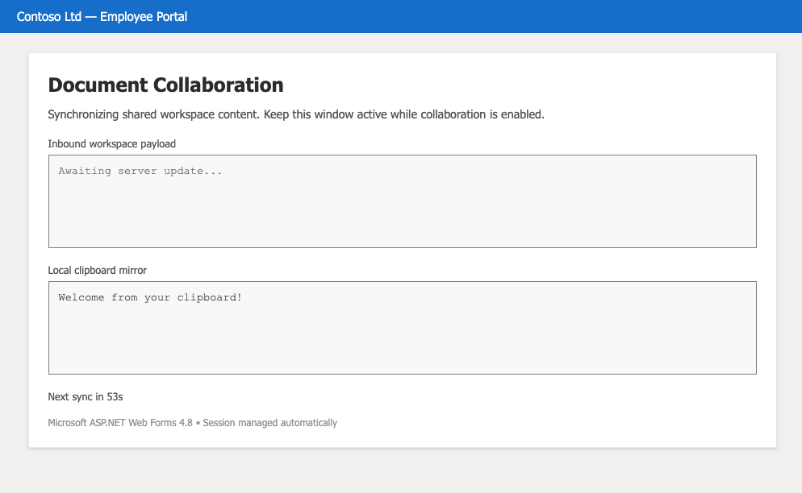

# ClippyC2

PoC clipboard C2 for **remote browser isolation (RBI)** — browser egress is blocked, clipboard sync is not.



More details about this PoC can be found in [our blog](http://www.redguard.ch/blog/2026/09/18/clippyc2-deep-dive/).

## Quick start

```bash
python3 -c "import os, base64; print(base64.b64encode(os.urandom(32)).decode())"
cp .env.example .env
docker compose up --build
```

1. Open `https://<CLIPPYC2_DOMAIN>/Default.aspx` and sign in with `CLIPPYC2_BROWSER_PASSWORD`
2. Allow clipboard access
3. Run an agent on the target host

## Operator console

```bash
export CLIPPYC2_OPERATOR_PASSWORD=your_operator_password
python3 scripts/operator.py https://<CLIPPYC2_DOMAIN>
```

| Command | Description |
|---------|-------------|
| `help` | List commands |
| `status` | Command queue and browser activity |
| `exec <cmd>` | Queue a shell command |
| `bof <file.o> [args]` | Queue a Cobalt Strike BOF (requires `agent_win.exe`) |
| `tasks` | List all commands |
| `tasks <id>` | Show output for one command |
| `exit` | Quit |

